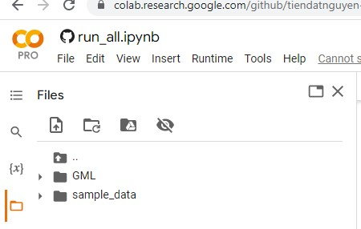
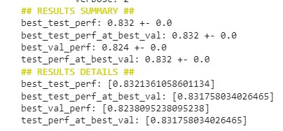

## Final project GML 
Enabling pure Transformer to perform well on large-scale graphs by knowledge-distillation from GNNs.

## IMPORTANT
You must put the folder "GML" under the directory "/content" of google colab. Like this:

## How to reproduce experiment results 
File run_all.ipynb contains all necessary commands to reproduce our experiment results

# Step 1: Library installation
Firstly, make sure that you're inside the /content/GML directory. Then run the first two cells of the file run_all.ipynb to install all necessary libraries. After that please restart runtime of google colab.

# Step 2: Run experiments
Firstly make sure that you're inside the directory /content/GML. Then please run all remaining cells consequently (order is important) to start the experiments. 
For example, when we run the cell "!bash run/Cora_ML/gat.sh", when training finishes, the output of the cell looks like this: 

Then, we will take "best_test_perf" under "Results summary" as the experiment result. Please run all those cells to produce all necessary results. There are some randomness in our implementation, so the output at each running time will be slightly different. So the result you see for "best_test_perf" might be a bit different from the result we report in the poster. But the difference should be marginal